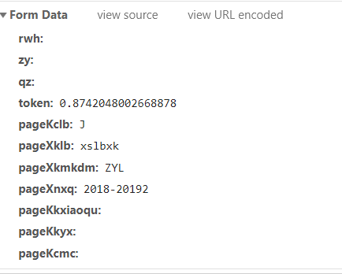

## 简介

这是个人用来爬取北航教务相应信息的程序，用于软工作业的数据获取，以后可能会改成通用的版本。

- 编程语言：python
- 需要安装的python库：scrapy

运行courseSpider中的main.py即可爬取教务课程信息。

使用前需要将courseSpider/spiders中的getCourse.py的jsession_id修改为自己的JSESSIONID值：可在浏览器的cookie中找到，最好使用windows10，chrome浏览器，之前爬取数据时发现jsession_id可能包含浏览器信息，如果使用不同的浏览器，会导致jsession_id与user-agent不符，从而被服务器拒绝访问。当然也可以将程序中的user-agent修改为自己浏览器的user-agent。

## 关于教务爬虫的一些关键点的提示：

例如教务界面 10.200.21.61：

token值和cookie中的JSESSIONID值是其验证合法性的”唯一“凭证。

例如统一登录界面 sso.buaa.edu.cn：

### 

lt值和cookie中的JSESSIONID值是其验证合法性的”唯一“凭证。

至于如何自动获取JSESSIONID值：

当你向服务器发起get请求时：

